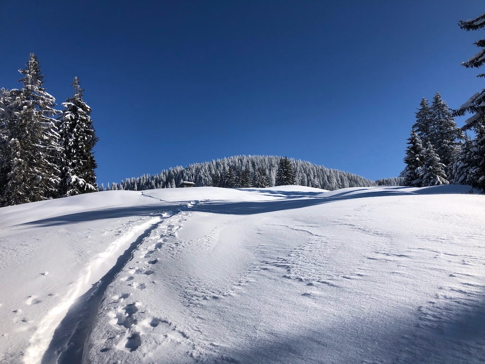

# Ski Mountaineering and Alpinism Resources

This site is a private collection of resources for ski mountaineering, organized by the typical planning stages as follows:

1. **Snow:** In which regions will be enough snow?
    * Measurements and data
    * Webcams
2. **Weather Forecast:** In which regions can we expect favorable weather conditions?
3. **Avalanche Risk and Alpine Conditions**: Which types of tours should we aim at?
    * Avalanche bulletins
    * Maps with slope steepness layers
    * Wind data
    * Local weather

## Snow Conditions

- [Snowfall Limits via MetGIS](https://www.metgis.com/de/domains/alpen/schneefallgrenze/gfs/)
- **Austria and South Tyrol**
    - [Snow: Maps](https://avalanche.report/weather/map/)
    - [Snow: Measurements](https://avalanche.report/weather/measurements)
- **Bavarian Alps**
    - [Snow: Measurements and Weather](https://lawinenwarndienst.bayern.de/schnee-wetter-bayern/wetter-schnee-messstationen/)
- **Swiss Alps**
    - [Snow: Maps](https://whiterisk.ch/de/conditions/snow-maps/new_snow)
    - [Snow: Measurements](https://whiterisk.ch/en/conditions/measurements/snow-depth)

## Weather Forecasts

- [Entire Alpine Region: DAV Bergwetter](https://services.alpenverein.de/DAV-Services/Bergwetter/)
- [Bavarian Alps: Weather by Lawinenwarndienst](https://lawinenwarndienst.bayern.de/schnee-wetter-bayern/bergwetterbericht-bayern/)
- [Austria: ZAMG Mountain Weather Forecast](https://www.zamg.ac.at/cms/de/wetter/produkte-und-services/bergwetter/oesterreich)

## Webcams

### Entire Alps

- [foto-webcam.eu: Map DE/AT/CH/IT](https://www.foto-webcam.eu/webcam/map/)
- [Meteoblue (Europe)](https://www.meteoblue.com/en/weather/webcams/hochgrat_germany_2903206)

### Bavaria

- [Bavarian Alps](https://lawinenwarndienst.bayern.de/schnee-wetter-bayern/webcams/)

### Switzerland

- [Switzerland](https://www.kaikowetter.ch/zentralschweiz.html)

## Avalanche Bulletins

- [Bavarian Alps: Lawinenwarndienst Bayern - Bulletin](https://lawinenwarndienst.bayern.de/)
    - [Bavarian Alps: Snow Profiles](https://lawinenwarndienst.bayern.de/schnee-wetter-bayern/schneeprofile/)
    - [Bavarian Alps: Fatal Incidents](https://lawinenwarndienst.bayern.de/toedliche-lawinenunfaelle-im-bayerischen-alpenraum/)
- [Austria and South Tyrol: Bulletin](https://lawinen.report/bulletin/latest)
    - [Austria: Snow Profiles](https://www.lawis.at/profile/)
- [Swiss Alps: SLF Bulletin](https://whiterisk.ch/de/conditions)
    - [Swiss Alps: Snow Profiles](https://whiterisk.ch/en/conditions/snow-profiles)
    - [Swiss Alps: Observed Avalanches and Incidents](https://whiterisk.ch/en/conditions/current-avalanches)

## Maps and Topographical Information

- [OpenSlopeMap.org - Maps with Slope Steepness](https://www.openslopemap.org/karte/)
- [Europe: Outdooractive Maps via DAV Portal](https://www.alpenvereinaktiv.com/de/membership/plans.html) [Paywall]
- **Austria**
    - [Tyrol: tirisMaps](https://maps.tirol.gv.at/) (Check option "Neigung in Grad")
    - [Austria: geoland.at Portal](https://www.geoland.at/)
- [Swiss Alps: Maps with Steepness Layer](https://map.geo.admin.ch/?topic=ech&lang=de&bgLayer=ch.swisstopo.pixelkarte-farbe&layers=ch.swisstopo.hangneigung-ueber_30&layers_opacity=0.55&zoom=6&E=2769042.27&N=1148438.36)

## Wind

- [Windy](https://www.windy.com/47.493/10.073?iconD2,gust,47.480,10.073,13)
- [Wetteronline.de: Historical Data](https://www.wetteronline.de/rueckblick) [Paywall]
- [Austria: zamg.ac.at Historical Data](https://www.zamg.ac.at/cms/de/wetter/wetterwerte-analysen/tawes-verlaufsgraphiken)
    - [Example: Rudolfshütte](https://www.zamg.ac.at/cms/de/wetter/wetterwerte-analysen/tawes-verlaufsgraphiken/rudolfshuette/wind_u_spitzen/?mode=geo&druckang=red)
- [Switzerland: Meteoblue Historical Weather Data](https://www.meteoblue.com/en/weather/archive/export) [Paywall]

## Additional Resources

### Open Data and Open Software

- [Austria: Geosphere API](https://dataset.api.hub.geosphere.at/v1/docs/#)
- [Austria: Open Data and Open Software](https://lawinen.report/more/open-data)
- [Austria: Latest Forecast as XML](https://avalanche.report/albina_files/latest/de.xml)
- [Austria: Salzburg Geodata](https://www.salzburg.gv.at/themen/salzburg/geodaten/download)
- [Germany: API Deutscher Wetterdienst](https://dwd.api.bund.dev/)
- [Switzerland: opendata.swiss](https://opendata.swiss/en/dataset?keywords_en=weather)

### Links

- [Markus Stadler: Informationsquellen zur Tourenplanung](https://www.stadler-markus.de/skitouren/informationsquellen-zur-tourenplanung.html) (in German)
- [DAV: alpenvereinaktiv.com](https://www.alpenvereinaktiv.com/de/)